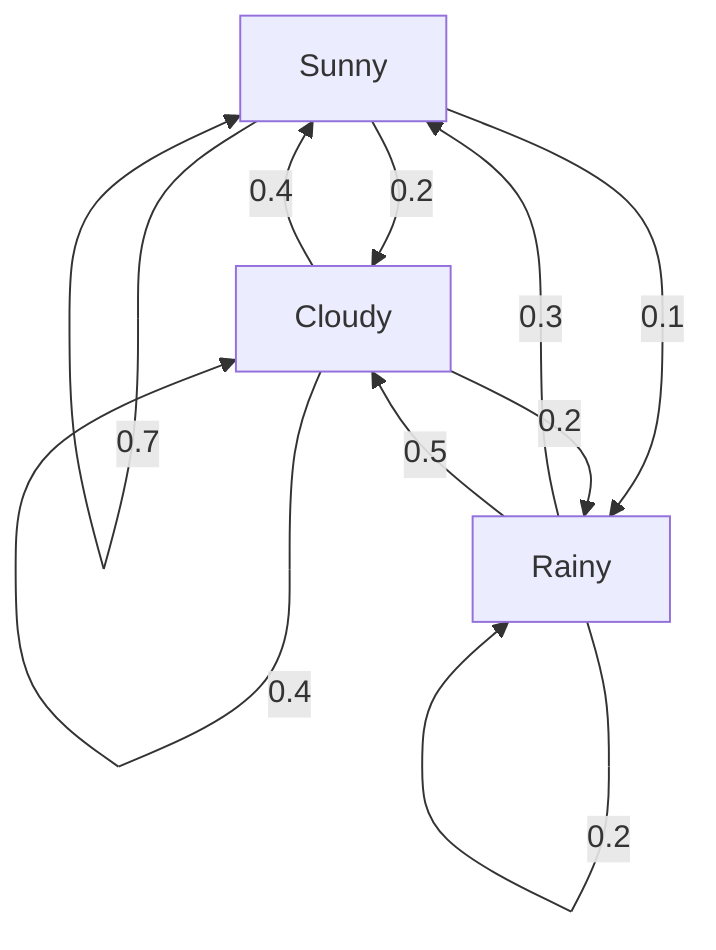
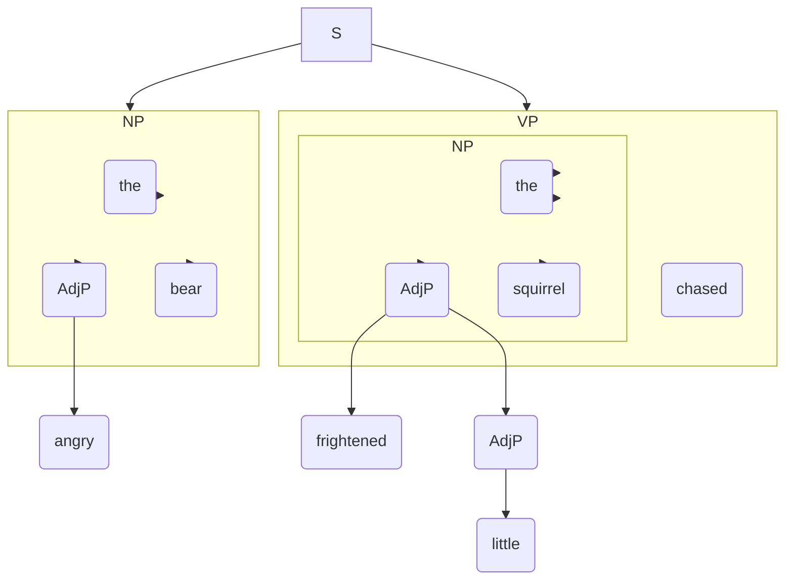

Module 3  5 MArkers

### 1. Examine Hidden Markov Model components in natural language processing.

A Hidden Markov Model (HMM) is a statistical model used for sequence labeling tasks in NLP, like Part-of-Speech (POS) tagging. It has the following key components:

1.  **Set of States (S):** These are the hidden or unobserved labels we want to infer. In POS tagging, the states are the set of all possible tags (e.g., {Noun, Verb, Adjective, Determiner}).
2.  **Observations (O):** These are the data points we can see. In POS tagging, observations are the words in a sentence (e.g., {"the", "cat", "sits", ...}).
3.  **Transition Probabilities (A):** This is a matrix representing the probability of moving from one state to another. It answers: what is the likelihood that a particular tag follows another tag?
    *   **Example:** `P(Verb | Noun)` is the probability that a verb comes after a noun.
4.  **Emission (or Observation) Probabilities (B):** This matrix represents the probability of a certain observation being generated from a certain state. It answers: what is the likelihood that a tag will produce a particular word?
    *   **Example:** `P("cat" | Noun)` is the probability that the Noun state will emit the word "cat."
5.  **Initial Probabilities (π):** This vector represents the probability of starting in each state.
    *   **Example:** `P(Determiner)` is the probability that a sentence begins with a determiner.

---

### 2. Relate left-to-right HMM with fully connected HMM.

The relationship is one of structure and constraint. A **left-to-right HMM** is a specialized, more constrained version of a **fully connected HMM**.

*   **Fully Connected HMM:** In this model, any state can transition to any other state (including itself). The transition probability matrix `A` can have non-zero probabilities for all `A[i][j]`. This structure is general-purpose and can model complex, non-linear sequences.

*   **Left-to-Right HMM:** This model imposes a strict directional flow. A state can only transition to itself or to a subsequent state (e.g., state `i` can only transition to state `j` where `j >= i`). There are no backward transitions. This structure is ideal for modeling processes that have a clear temporal progression, like spoken words in speech recognition, where phonemes occur in a fixed order.

**Relation:** You can think of a left-to-right HMM as a fully connected HMM where many of the transition probabilities (the ones that would go "backward") are permanently set to zero.

---

### 3. Investigate dynamic programming algorithm to store intermediate values.

Dynamic programming is an algorithmic technique for solving problems by breaking them down into simpler, overlapping subproblems. The key is to solve each subproblem only once and store its result in a table to avoid redundant computations. This "memoization" is crucial for efficiency in many NLP tasks.

A classic example in NLP is the **Viterbi algorithm**, used to find the most likely sequence of hidden states in an HMM.

*   **Problem:** Finding the best tag sequence for a long sentence involves an exponential number of possible paths.
*   **Dynamic Programming Solution:** The Viterbi algorithm builds a table (or "trellis") column by column. For each word (observation), it calculates the most probable path *to each possible state (tag)* at that step. It stores this probability and a backpointer to the previous state that led to it.
*   **How it Stores Intermediate Values:** Instead of re-calculating the best path from the beginning for every state, it just extends the best paths found for the previous word. By storing the highest probability for reaching each tag at each step, it efficiently prunes all suboptimal paths, reducing the complexity from exponential to polynomial.

---

### 4. Explain Markov chain structure with proper diagram.

A **Markov chain** is a mathematical model that describes a sequence of events where the probability of the next event depends only on the current state, not on the sequence of events that preceded it. This is known as the **Markov property** or memorylessness.

The structure consists of:
*   A set of **states**.
*   **Transition probabilities** for moving from one state to another.

**Example: A Simple Weather Model**
Let's model a day's weather with three states: Sunny, Rainy, and Cloudy. The model defines the probability of tomorrow's weather given today's weather.

**Diagram:**

*   **Interpretation of the Diagram:**
    *   If it's **Sunny** today, there's a 70% chance it will be Sunny tomorrow, a 20% chance it will be Cloudy, and a 10% chance it will be Rainy.
    *   If it's **Cloudy** today, there's a 40% chance of Sun, 40% chance of Cloud, and 20% chance of Rain tomorrow.
    *   Notice how the sum of outgoing probabilities from each state equals 1 (e.g., for Sunny: 0.7 + 0.2 + 0.1 = 1.0).

---

### 5. Execute the expectation maximization in text analysis.

The Expectation-Maximization (EM) algorithm is an iterative method for finding model parameters when the data has missing or hidden variables. It is widely used in text analysis for tasks like topic modeling with Latent Dirichlet Allocation (LDA) or training HMMs without labeled data.

The process alternates between two steps:
1.  **E-Step (Expectation):** In this step, we use the current model parameters to "guess" or calculate the probabilities of the hidden variables. In topic modeling, this means for each word in a document, we would calculate the probability that it was generated by each topic (e.g., this instance of "bank" is 70% likely from the 'Finance' topic and 30% from the 'Geography' topic).

2.  **M-Step (Maximization):** In this step, we use the probabilities calculated in the E-step as if they were true counts to update and improve our model parameters. We would re-calculate the word distributions for each topic, making 'Finance' more strongly associated with "bank," and re-calculate the topic distributions for each document.

These two steps are repeated until the model parameters converge (i.e., they stop changing significantly).

---

### 6. Develop lexical syntax on any sentence and apply parts of speech tagging.

Let's use the sentence: "**The quick runners passed their goal easily.**"

**1. Lexical Syntax (Morphological Analysis):**
Lexical syntax involves breaking words down into their meaningful components (morphemes: stem, prefixes, suffixes) to understand their structure.
*   **The:** Monomorphemic (cannot be broken down).
*   **quick:** Monomorphemic (stem).
*   **runners:** `runner` (stem) + `-s` (plural suffix). The stem `runner` is `run` + `-er` (agentive suffix).
*   **passed:** `pass` (stem) + `-ed` (past tense suffix).
*   **their:** Monomorphemic.
*   **goal:** Monomorphemic.
*   **easily:** `easy` (stem) + `-ly` (adverbial suffix). Note the spelling change from `y` to `i`.

**2. Parts of Speech (POS) Tagging:**
This step applies a grammatical label to each word in the sentence.
*   **The:** Determiner (DT)
*   **quick:** Adjective (JJ)
*   **runners:** Plural Noun (NNS)
*   **passed:** Past Tense Verb (VBD)
*   **their:** Possessive Pronoun (PRP$)
*   **goal:** Singular Noun (NN)
*   **easily:** Adverb (RB)

---

### 7. Derive a top-down, depth-first, left-to-right parse tree for the given sentence.

**Sentence:** "The angry bear chased the frightened little squirrel"

Since no grammar rules were provided, I will use a plausible set of rules for this sentence.

**Grammar Rules:**
1.  `S -> NP VP`
2.  `NP -> Det AdjP N`
3.  `AdjP -> Adj | Adj AdjP`
4.  `VP -> V NP`
5.  `Det -> the`
6.  `Adj -> angry | frightened | little`
7.  `N -> bear | squirrel`
8.  `V -> chased`

**Top-down, Depth-first, Left-to-right Derivation:**

1.  Start with **S**.
2.  Expand **S** using Rule 1: `S -> NP VP`. (Go left and deep first).
3.  Expand **NP** using Rule 2: `NP -> Det AdjP N`.
4.  Expand **Det** using Rule 5: `Det -> the`. Match "The".
5.  Expand **AdjP** using Rule 3: `AdjP -> Adj`.
6.  Expand **Adj** using Rule 6: `Adj -> angry`. Match "angry".
7.  Expand **N** using Rule 7: `N -> bear`. Match "bear". (The first NP is complete).
8.  Return to **VP** (from Step 2). Expand **VP** using Rule 4: `VP -> V NP`.
9.  Expand **V** using Rule 8: `V -> chased`. Match "chased".
10. Expand **NP** using Rule 2: `NP -> Det AdjP N`.
11. Expand **Det** using Rule 5: `Det -> the`. Match "the".
12. Expand **AdjP** using Rule 3: `AdjP -> Adj AdjP`.
13. Expand the first **Adj** using Rule 6: `Adj -> frightened`. Match "frightened".
14. Expand the remaining **AdjP** using Rule 3: `AdjP -> Adj`.
15. Expand this final **Adj** using Rule 6: `Adj -> little`. Match "little".
16. Return to **N** (from Step 10). Expand **N** using Rule 7: `N -> squirrel`. Match "squirrel".
17. All words are matched. The parse is successful.

**Final Parse Tree Diagram:**

